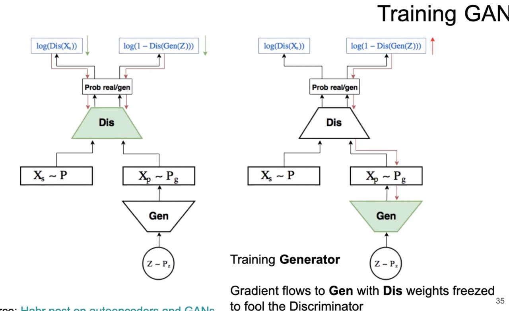
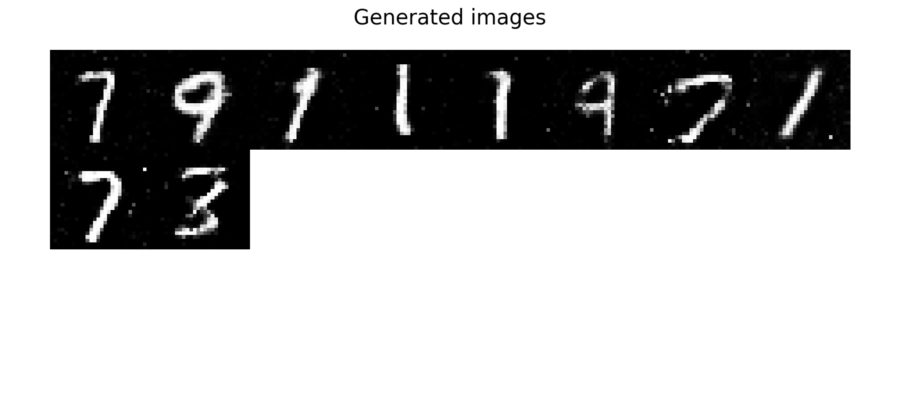
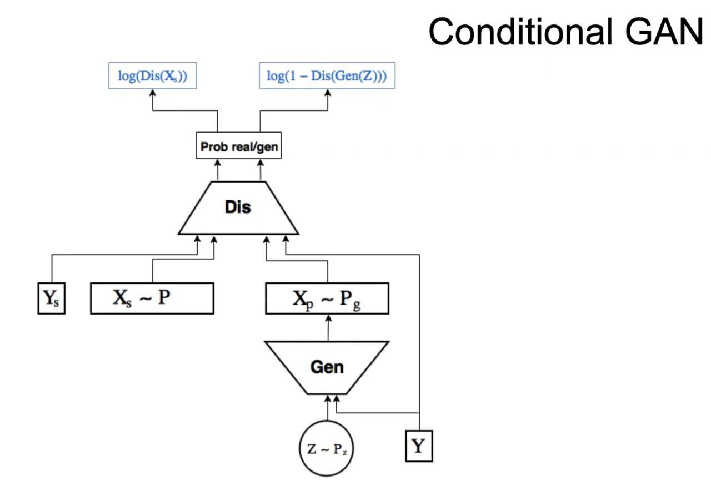

# GAN on MNIST 
> Generative adversarial network train and running on MNIST
## Overview

## Reminding arch

## Quick start 

`git clone https://github.com/Pricolno/ml_expirements.git`

`cd ml_expirements/mnist`

`python3 -m venv env`

`source env/bin/activate`

`pip install -r requirements`

`cd GAN`

### Train

`python3 train.py`

for logging run other process, [guide](https://pytorch.org/tutorials/recipes/recipes/tensorboard_with_pytorch.html)

`tensorboard --logdir=runs`

watch http://localhost:6006/

### Generation 

`PYTHONPATH=. python3 generation/generat.py`

## How do overiview gifs
described in `animation.ipynb`

## Remark
I work on mac m1, then use `torch.device('mps')` 

## Future
Contition GAN

## References

* [habr](https://habr.com/ru/articles/726254/)
* [kaggle](https://www.kaggle.com/competitions/digit-recognizer/data)

